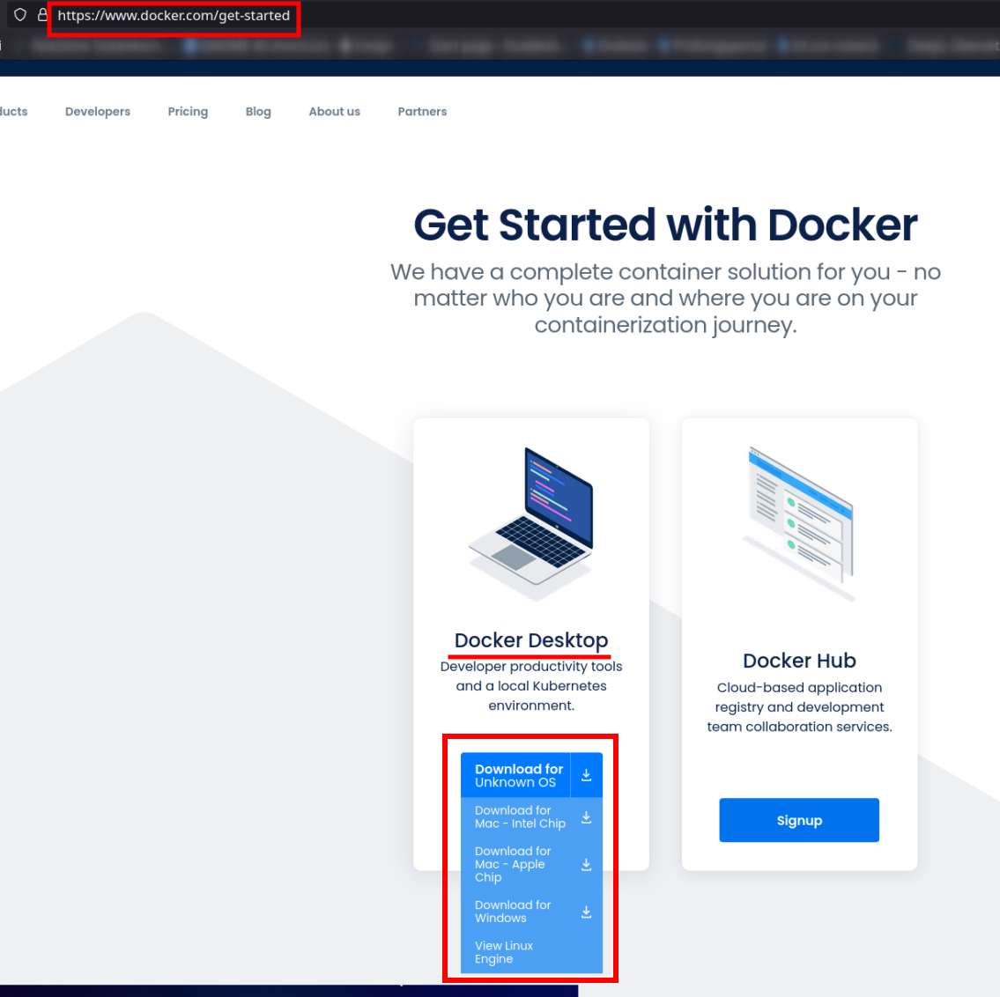
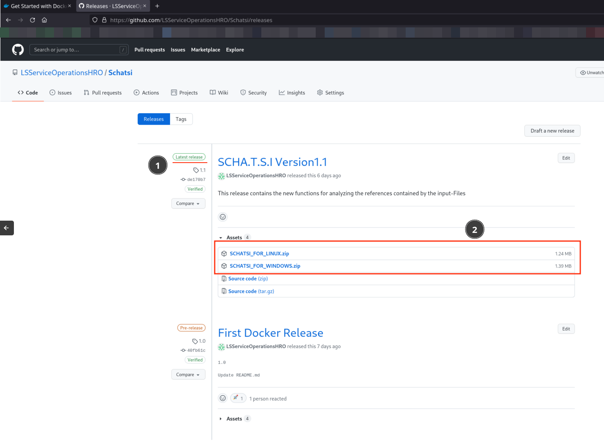

# SCHA.T.S.I
(GERMAN VERSION AT THE BOTTOM OF EACH CHAPTER)

SCHA.T.S.I - An abbreviation for '**SCH**eduling *A*lgorithm for **T**ext **S**each **I**ntelligence'.
This project is located at the Chair of Service Operation at the University of Rostock. As development progresses, the software is intended to accelerate the analysis of scientific papers and publications and to provide the user with an overview of the interrelationships between papers and a prioritization of publications for the user with respect to his self-imposed specifications, even when hundreds of publications are involved.
In addition to the analysis, the results will be provided not only in tabular form, but additionally in a graphical overview to be able to penetrate the relationships between the papers and their authors.
For this purpose, techniques of text analysis, natural language processing (NLP) and machine learning (ML) are used.

Currently, SCHA.T.S.I can be used on Windows and Linux and with Release 1.3 a Beta version for MacOS accessible (No Guarrentee - Feedback is Welcome) :-)

---

SCHA.T.S.I - Eine Abkürzung für '**SCH**eduling *A*lgorithm for **T**ext **S**each **I**ntelligence'
Dieses Projekt ist am Lehrstuhl Service Operation an der Universität Rostock angesiedelt. Mit fortschreitendem Entwicklungsstand soll die Software die Analyse von wissenschaftlichen Papern und Veröffentlichungen beschleunigen und dem Nutzer selbst bei hunderten Veröffentlichen einen Überblick über die Zusammenhänge zwischen den Papern und eine Priorisierung der Veröffentlichungen für den Nutzer hinsichtlich seiner selbstgestellten Vorgaben bereit stellen.
Neben der Analyse sollen die Ergebnisse nicht nur in tabellarischer Form, sondern zusätzlich in einer grafischen Übersicht bereitgestellt werden, um die Zusammenhänge zwischen den Papern und ihren Autoren durchdringen zu können.
Dazu werden Techniken der Textanalyse, der Verarbeitung natürlicher Sprache (NLP) und des Maschinellen Lernens (ML) eingesetzt.

Aktuell kann SCHA.T.S.I auf Windows und Linux genutzt werden, des Weiteren ist eine Beta Version für MacOS ab Release 1.3 verfügbar (Keine Garantien - Feedback erwünscht) :-) 

## How to run SCHATSI

### Systemrequirements

For all operating systems, the presence of a up-to-date **Docker** installation is a prerequisite for using the software, since SCHA.T.S.I is provided as a Docker image.
Furthermore, on a Linux system **Docker-Compose** must be installed additionally, as it is not available in the Linux variant of Docker -in contrast to Docker for Windows.

On Docker's website, installers for all common operating systems are available. Docker: https://www.docker.com/get-started

On Linux, the software stores of the respective distribution can also be used.

---
Für alle Betriebssysteme ist das Vorhandensein einer aktuellen **Docker** Installation Vorrraussetzung für die Nutzung der Software, da SCHA.T.S.I als Docker-Image bereitgestellt wird.
Des Weiteren muss auf einem Linux-System **Docker-Compose** zusätzlich installiert werden, da es in der Linux-Variante von Docker -im Gegensatz zu Docker für Windows- nicht vorhanden ist.

Auf der Website von Docker sind Installer für alle gängigen Betriebssysteme vorhanden. Docker: https://www.docker.com/get-started

Auf Linux können zudem die Software-Stores der jeweiligen Distribution genutzt werden.

 

 

A guide for the installation under Windows, should there be problems, can be found here.
Eine Anleitung für die Installation unter Windows, sollte es Probleme geben finden Sie hier.
https://docs.docker.com/desktop/windows/install/

### Running SCHA.T.S.I

After Docker has been installed you will need to download the latest version of our software. You can find it on the right side of this Github page under **RELEASES**. There you will find a .zip folder for your operating system under each release with the tag "latest release".
Download this and unzip the content into a folder of your choice. 

---

Nachdem Docker installiert wurde müssen sich die aktuelle Version unserer Software herunterladen. Diese finden Sie auf der rechten Seite dieser Github-Seite unter **RELEASES**. Dort finden sie unter der Veröffentlichung mit dem Tag "latest release" jeweils einen .Zip-Ordner für ihr Betriebssystem.
Dieses laden Sie herunter und entpacken den Inhalt in einen Ordner ihrer Wahl. 
 

 

You will receive two files: "docker-compose.yml", "SCHATSI_RUN" and a PDF file with a summary for using the software.

**Important: The included files must be in the same folder for an error-free functioning of the software!**

To start the software you now have to run the "SCHATSI_RUN" file. That was all. No complicated installations, no configuration. Just start it and that's it. (Note: Under some systems it may be necessary to run the "SCHATSI_RUN" with administrator rights, as Docker requires administrator rights under some systems)

A window will open where you navigate to your folder with the PDF files you want to examine. After that, SCHA.T.S.I will do the work for you and put its results in a folder named "output". You will find this folder in the same place on this system where you placed the two unzipped files.

---

Sie erhalten zwei Dateien: "docker-compose.yml", "SCHATSI_RUN" und eine PDF-Datei mit einer Zusammenfassung für die Nutzung der Software.

**Wichtig: Die enthaltenen Dateien müssen sich für ein fehlerfreies Funktionieren der Software in einem gemeinsamen Ordner befinden!**

Um die Software zu starten müssen Sie nun noch die "SCHATSI_RUN"-Datei starten. Das war alles. Keine umständlichen Installationen, keine Konfiguration. Einfach starten und das wars. (Hinweis: Unter einigen Systemen kann es nötig sein, die "SCHATSI_RUN" mit Administratorrechten auszuführen, da Docker unter einigen Systemen Administratorrechte voraussetzt)

Es öffnet sich ein Fenster, in dem Sie zu ihrem Ordner mit den zu untersuchenden PDF-Dateien navigieren. Im Anschluss daran, wird SCHA.T.S.I die Arbeit für Sie übernehmen und seine Ergebnisse in einem Ordner mit dem Namen "output" ablegen. Diesen finden Sie an dem Ort auf diesem System, an dem Sie die beiden entpackten Dateien abgelegt haben.

## How does it work?
In this chapter we will explain how SCHA.T.S.I does its work and how we choose the libraries and modules which we use to build the software.

### Text Extraction using "pdftotext"-Library

We have chosen the Python library "pdftotext" for extracting the text from PDF's files. This has several reasons

- Firstly, all words in our samples were correctly recognized
- The library allows to keep text and page structuring when outputting as string which is useful to recognize specific constructs, for example, the references of a Harvard citation style paper, where inserts are used to organize the bibliography rather than consecutive numbers 
- It also recognizes text on figures, diagrams and in tables, which increases the correctness of predictions for publications with a high proportion of these elements
- The library is compact and therefore easy to use
 

