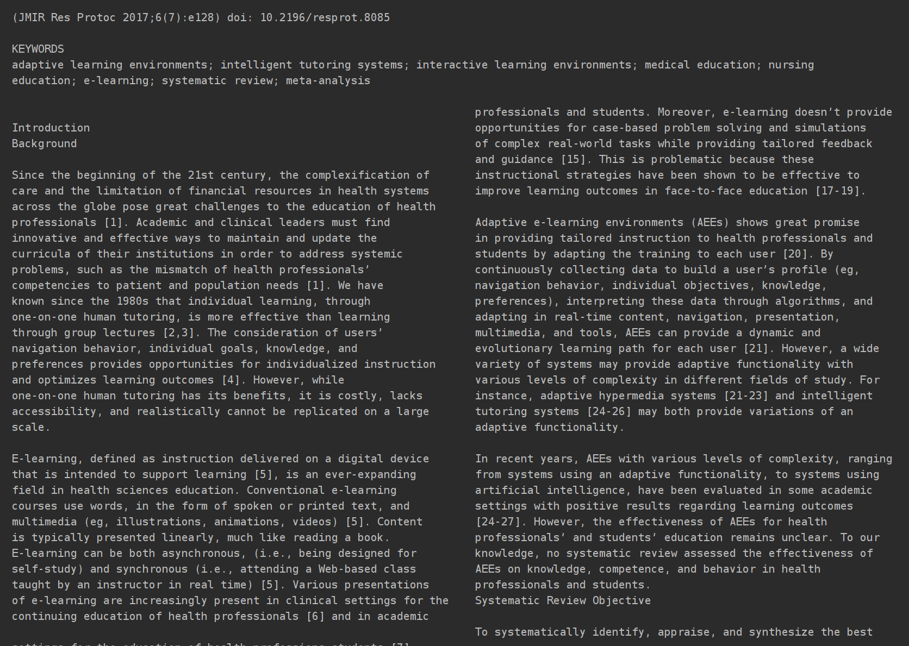

# Schatsi
Dieses Projekt ist am Lehrstuhl Service Operation an der Universität Rostock angesiedelt.

## How to run SCHATSI

## Release new SCHATSI version
1. Open "docker-compose.yml" and update image description. Naming convention = schiggy89/schatsi:YYMMDD.index .
2. Open cmd enter: docker build -t schiggy89/schatsi:YYMMDD.index .
3. docker push schiggy89/schatsi:schatsi:YYMMDD.index

## Text Extraction using "pdftotext"-Library

We have chosen the Python library "pdftotext" for extracting the text from PDF's files. This has several reasons

- Firstly, all words in our samples were correctly recognized
- The library allows to keep text and page structuring when outputting as string which might be useful in the future
- It also recognizes text on figures, diagrams and in tables, which increases the correctness of predictions for publications with a high proportion of these elements
- The library is compact and therefore easy to use

